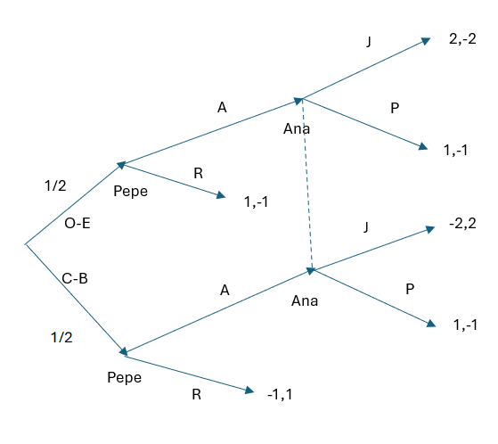
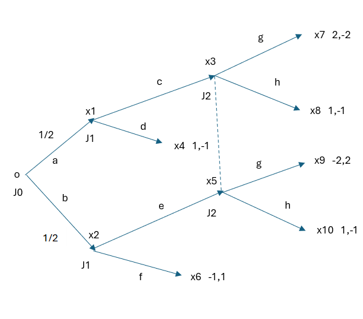
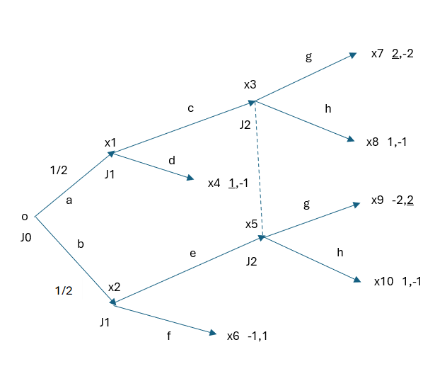

---
output:
  pdf_document:
    keep_tex: yes
    number_sections: yes
    citation_package: natbib  # comentado usa: pandoc-citeproc
    template: latex/templateMemoriaTFE.tex
    pandoc_args: ["--metadata-file=cabecera_capitulos.yaml"]
  html_document: default
#bibliography: bib/library.bib # descomentar si: editor visual RStudio  
---

<!-- escribir 2 para capítulo 3 -->
<!-- \setcounter{chapter}{2} --> 
<!-- \pagenumbering{arabic} -->

`r xfun::file_string('cabecera_capitulos.tex')`

```{r include=FALSE}
source("cabecera_chunk_inicio.R")
```


# Tipos y formas de un juego. Equilibrio de Nash{#Seccion2}

## Tipos de juego{#Seccion21}

*Juegos según el número de jugadores*

Según el numero de jugadores nos encontramos con los juegos bipersonales, de 2 personas como puede ser el ajedrez, o n-personales en el que participan mas de 2 jugadores como en el poker.

*Juegos cooperativos y no cooperativos*

Los juegos cooperativos son aquellos en los que entre varios jugadores acuerdan no competir entre ellos sino buscar un mismo objetivo ganando o perdiendo a la misma vez. En los juegos no cooperativos, que son los casos mas generales, los jugadores deciden de forma independiente buscando sacar un beneficio máximo de las distintas situaciones.

*Juegos de información completa e incompleta*

En los juegos de información completa, todos los jugadores tienen tienen la misma información, conocen las estrategias que pueden seguir el resto de jugadores y las recompensas que recibirían. 

*Juegos simultáneos y secuenciales*

En los juegos simultáneos, los jugadores toman sus decisiones a la vez, y por tanto desconocen la estrategia que va a seguir el resto de jugadores. Por otro lado los secuenciales los jugadores toman las decisiones uno tras otros, pudiendo modificar sus estrategias en función de las del resto de jugadores. La información que tengan del resto de los otros jugadores no tiene porque ser perfecta.

*Juegos en función de la suma de los beneficios de los jugadores*

Dependiendo de la suma de los beneficios entre todos los jugadores encontramos tres casos:

*Suma cero: En esta clase de juegos, uno de los jugadores se beneficia del resto de jugadores obteniendo como beneficio las pérdidas de los otros jugadores.

*Suma no nula: En ellos el balance entre pérdidas y beneficios de los jugadores no tiene porque ser 0 por lo que la ganancia o pérdida de los jugadores no se compensa.

*Juegos simétricos y asimétricos*

En los juegos simétricos los jugadores pueden tomar las mismas decisiones, por lo que los beneficios solo dependen de las estrategias empleadas y no de los jugadores. Mientras tanto, en los juegos asimétricos las estrategias no tienen por que reportar el mismo beneficio a un jugador que a otro.

*Juegos discretos y continuos*

En los juegos discretos los jugadores toman sus decisiones en un conjunto finito de estrategias. En los juegos continuos extendemos esta idea permitiendo conjunto de ideas infinito no numerable.

*Juegos de longitud finita o infinita*

Si el juego termina tras un número finito de movimientos sera de longitud finita. En los juegos de longitud infinita hay infinitos movimientos y el ganador no se conoce hasta que se conocen todos los movimiento.

*Juegos repetidos o iterados*

Cuando los jugadores tras un movimiento de cada jugador vuelven a tener que decidir en un escenario similar varias veces seguidas, observando las estrategias y recompensas que han han obtenido el resto. En cada etapa los jugadores pueden modificar su estrategia anterior.

## Formas de representacion de un juego{#Seccion22}

### Forma normal o estratégica{#Seccion221}

Comenzamos con la manera mas sencilla de representar un juego. En ella asumimos que los jugadores toman sus decisiones a la vez sin conocer las decisiones de los otros jugadores. Se asume como comentamos anteriormente en la sección $\ref{Seccion12}$ que los jugadores actúan racionalmente y que siguen la estrategia (concepto que se definió también al final del subapartado $\ref{Seccion11}$) que mas les beneficie sin poder acordar con los adversarios estrategias beneficiosas para ambos.

Vamos a comenzar un ejemplo que iremos desarrollando a lo largo de esta sección conforme sigamos ampliando en el concepto de forma normal de un juego 
**Ejemplo**
Supongamos que en un barrio de una ciudad se encuentran dos locales amplios disponibles para poder montar un negocio. Dos hamburgueserías distintas, llamemoslas A y B están interesadas en montar un negocio en ellas. Tienen que tomar las siguientes decisiones: Montar negocio y no montar negocio. Como es lógico, las ganancias dependerán de si la otra empresa decide montar el negocio al final

Esta forma suele venir representada en forma de tabla que muestra el  umero de jugadores, las posibles estrategias de cada uno y los pagos o utilidades que recibe cada jugador en función de las decisiones que ha tomado cada uno. Lo ilustramos con el ejemplo anterior.

$$
\begin{array}{c|c|c}
 & \text{Montar} & \text{No Montar} \\
\hline
\text{Montar} & 1,1 & 4,0 \\
\hline
\text{No Montar} & 0,4 & 0,0 \\
\hline
\end{array}
$$
Así de un vistazo tenemos claro que el juego consiste de dos jugadores con dos posibles decisiones en ambas estrategias (montar o no montar el negocio) y los pagos o ganancias que tendrían cada uno en función de su decisión y la del adversario. A continuación pasamos a definir de una manera rigurosa el concepto de forma normal de un juego estratégico.

*Definición*
Podemos caracterizar un juego en forma normal a partir de:

* Un conjunto de jugadores $N=\{1,\cdots,n\}$. 

* Un conjunto de estrategias $S=(S_1,\cdots,S_n)$ tal que $S_i$ es el conjunto de estrategias de cada jugador $i \in N$.

* Unas funciones de utilidad de Von Neumann-Morgenstern $U_i:S=S_1x\cdots xS_n \rightarrow \mathbb{R}$ que asigna a cada una de las estrategias el pago que el jugador $i$ recibe.

Así pues podemos formalizar nuestro ejemplo como hemos explicado:
Tenemos dos jugadores A y B (las dos empresas) por lo que $N=\{1,2\}$. Cada uno de ellos tiene dos posibles decisiones, que son montar o no montar el negocio, por lo que $S=(S_1,S_2), \ S_i=(M,NM), \ i=1,2$. Y tenemos los respectivos pagos o utilidades que reciben en función de las estrategias seguidas:
$U_1(M,NM)=4$, $U_1(M,M)=1$, $U_1(NM,NM)=0$, $U_1(NM,M)=0$, $U_2(M,NM)=0$, $U_2(M,M)=1$, $U_2(NM,NM)=0$ y $U_2(NM,M)=4$  

### Forma extensiva{#Seccion222}
Al contrario de la suposición que hemos realizado en el apartado anterior de que los jugadores tomaban las decisiones a la vez, en este caso obviamos este hecho y abrimos la posibilidad de que los jugadores tomen las decisiones de manera secuencial. Con esta forma dejamos de limitarnos a ese hecho y podemos fijar las distintas secuencias de jugadas que tiene un juego como la información de la que dispone cada jugador antes de tomar la decisión. Al igual que hemos hecho en la sección $\ref{Seccion221}$ vamos a acompañar la explicación de esta forma con un ejemplo

*Ejemplo* Supongamos que tenemos una baraja clásica, con 4 palos (oros, bastos, copas y espadas) con 12 cartas cada uno de los palos (del 1 al9, sota, caballo y rey) y que está barajada. Sean dos jugadores Pepe y Ana. Para participar, cada uno de los jugadores apuesta 1 euro. Pepe saca una carta del mazo ve cual es, y tiene dos posibles opciones, retirarse o apostar poniendo otro euro. Si se retira con la carta siendo un oro o una espada, el dinero que hay en la mesa es para él, mientras que si la carta es una copa o un basto el dinero es para Ana. En cambio, si apuesta un euro más, le toca a Ana jugar, y ella puede pasar, en cuyo caso el dinero se lo lleva Pepe o puede decidir jugar. Para ello, apuesta un euro más y saca una carta. Si es un oro o una espada, se lleva todo el dinero Pepe, y si es una copa o un basto se lo lleva todo Ana.  

La forma mas común de representación es mediante un árbol de decisión. En el que en cada nodo aparece el jugador que toma la decisión, del cual salen aristas hacia otros nodos que representan las posibles estrategias de ese jugador en dicho nodo y que situaciones del juego se derivan. Al final, nos encontramos con los nodos terminales donde una vez los jugadores ya han tomado todas las posibles decisiones se representan las utilidades o pagos que reciben cada uno de los jugadores. Hay que entender que esta representación tiene limitaciones en el hecho de que las estrategias pueden ser continuas o tener infinidad de etapas como ocurre con el ajedrez.

Así pues el ejemplo anterior podríamos representarlo en forma de árbol de la siguiente forma:

```{r forma_extensiva, fig.cap = "\\label{forma_extensiva}Diagrama Juego", fig.align='center',out.width='80%',echo=FALSE}

```
La linea discontinua uniendo los dos nodos donde participa la jugadora Ana denotan que no sabe en que parte del árbol se encuentra, es decir, hace si apuesta o se retira sin saber de que palo es la carta que saca


Al igual que hicimos en la forma normal de un juego, vamos a caracterizar la forma extensiva de un juego por los distintos elementos que intervienen en tal representación

*Definición* Un juego en forma extensiva $\Gamma$ viene caracterizado por una 7-tupla: 
 $$\Gamma=\{J,X,A,\{X_i\}_{i \in J},H,P,U \}$$
Los elementos que lo forman son:

*Conjunto de jugadores que participan en el juego $J=\{1,\cdots,N\}$. También es común denotar como jugador 0 a los movimientos que se realizan aleatoriamente.

*$X$, conjunto de nodos, que significan una posible situación del juego. El nodo inicial se representa por $o$. A partir de este conjunto podemos diferenciar dos: $T(X)$ conjunto de nodos terminales del juego, y $D(X)=X-T(X)$ los nodos donde algún jugador tiene que tomar una decisión (no final)


*$A$, conjunto de todas las posibles acciones del juego

*Para cada jugador $i \in J$, sea $X_i$ los nodos en los que el jugador $i$ tiene que tomar una decisión

*$H$, familia de conjuntos de información que son la información que conoce el jugador en cada nodo.

*Una función de probabilidad 
$$
\begin{array}{cccc}
P : & H_o \times A & \rightarrow & [0,1] \\
   &  (h,a) & \rightarrow   & P(h,a)
\end{array}
$$
que proporciona una probabilidad a las acciones en los que interviene el azar.

*Función de pagos o utilidad 
$$
\begin{array}{cccc}
U: & T(X) & \rightarrow & \mathbb{R}^N \\
   &  x & \rightarrow   & U(x)=(U_1(x),\cdots,U_N(x))
\end{array}
$$
donde $U_i(x)$ representa la utilidad que recibe el jugador i. Podemos suponer que estas funciones son de Von Newmann-Morgenstern

Al igual que hicimos en el apartado anterior, vamos a formalizar el ejemplo que hemos propuesto en forma extensiva: Tenemos los jugadores $J=\{0, Pepe, Ana\} = {0,1,2}$; el conjunto de nodos $X=\{0,x_1,x_2,x_3,x_4,x_5,x_6,x_7,x_7,x_8,x_9 \}$; el conjunto de acciones $A=\{Ac_1,Ac_2,Ac_3,Ac_4,Ac_5,Ac_6,Ac_7,Ac_8 \}$; los conjuntos de decisión para cada jugador $X_i, \ i \in J=\{0,1,2\}$, $X_0=\{o \}$, $X_1=\{x_1,x_2 \}$, $X_2= \{x_3,x_5 \}$ ; el conjunto de información de la que disponen los jugadores $H=\{ \{o\}, \{x_1\},\{x_2\}, \{x_3,x_5\} \}$; la funcion de probabilidad para cada una de las acciones en las que interviene el azar, $P(\{o\},a)=\frac{1}{2}$ y $P(\{o\},b)=\frac{1}{2}$; y las funciones de pagos que reciben los jugadores en los distintos nodos finales, $U(x_4)=(1,-1)$, $U(x_6)=(-1,1)$, $U(x_7)=(2,-2)$, $U(x_8)=(1,-1)$, $U(x_9)=(-2,2)$, $U(x_10)=(1,-1)$. Así pues, vamos a ver el diagrama del juego con esta forma de escribirlo mas rigurosa:

```{r forma_extensiva_rigurosa, fig.cap = "\\label{forma_extensiva_rigurosa}Diagrama Juego", fig.align='center',out.width='80%',echo=FALSE}

```

## Equilibrio de Nash{#Seccion23}

De manera coloquial diríamos que un juego se encuentra en equilibrio si ningún jugador obtiene mas utilidad al cambiar su estrategia de manera unilateral, es decir, cada elección es la mejor respecto al resto de elecciones de los adversarios, así ningún jugador tiene razones para cambiar du elección y por tanto el juego se encuentra en equilibrio. Pasamos a aportar una definición formal de este concepto.

*Definición: Equilibrio de Nash en estrategias puras* Dado un juego $G=\{S_1,\cdots,S_n,U_1,\cdots,U_n\}$, un perfil de estrategias puras $(s_1^*,\cdots,s_{i-1}^*,s_i^*,s_{i+1}^*,\cdots,s_n^*)$ es un Equilibro de Nash si 
$$
\forall i \in N, \ U_i(s_1^*,\cdots,s_{i-1}^*,s_i^*,s_{i+1}^*,\cdots,s_n^*) \geq U_i(s_1^*,\cdots,s_{i-1}^*,s_i,s_{i+1}^*,\cdots,s_n^*), \ \forall s_i \ \text{de} \ S_i
$$

A continuación resolveremos los ejemplos que hemos seccionado en las secciones $\ref{Seccion221}$ y $\ref{Seccion222}$ 

### Resolución de un juego en forma normal{#Seccion231}
Recordamos que tenemos el juego con la siguiente matriz:
$$
\begin{array}{c|c|c}
 & \text{Montar} & \text{No Montar} \\
\hline
\text{Montar} & 1,1 & 4,0 \\
\hline
\text{No Montar} & 0,4 & 0,0 \\
\hline
\end{array}
$$
En este juego tenemos las siguiente soluciones posibles: ($Montar$,$Montar$), ($Montar$,$No \ Montar$), ($No \ Montar$,$Montar$) y ($No \ Montar$,$No \ Montar$).

Comenzamos analizando la solución ($No \ Montar$,$No \ Montar$) suponiendo que es un Equilibrio de Nash. Si la empresa A piensa que la empresa B no montará el negocio es claro que no le interesa mantener su decisión en no montar el negocio puesto que su utilidad aumenta de 0 a 4. De esta forma cualquiera de las dos empresas (ocurre lo mismo porque son simétricas) cambiará su estrategia a montar el negocio.  

Ahora analicemos el caso ($Montar$,$No \ Montar$), que tiene un razonamiento similar al caso ($No \ Montar$,$Montar$), y volvemos a suponer que es un Equilibrio de Nash. En esta situación, si la empresa B supiese que la empresa A va a decidir montar el negocio esta cambiara su estrategia y montaría también el negocio aumentando así su utilidad de 0 a 1. Por lo tanto estas dos opciones ($Montar$,$No \ Montar$) y  ($No \ Montar$,$Montar$) no son un equilibrio de Nash.

De esta forma solo nos quedaría la siguiente solución posible ($Montar$,$Montar$) que si es un Equilibrio de Nash puesto que ambas empresas disminuyen la utilidad que perciben si alguna de ellas cambia a no montar el negocio. De manera gráfica podemos representarlo con la matriz anterior

$$
\begin{array}{c|c|c}
 & \text{Montar} & \text{No Montar} \\
\hline
\text{Montar} & \underline{1},\underline{1} & \underline{4},0 \\
\hline
\text{No Montar} & 0,\underline{4} & 0,0 \\
\hline
\end{array}
$$
y ($Montar$,$Montar$) es el equilibrio de Nash

### Resolución de un juego en forma extensiva{#Seccion232}
Recordemos que hemos llegado al siguiente esquema del juego:

```{r forma_extensiva_rigurosa_2, fig.cap = "\\label{forma_extensiva_rigurosa_2}Diagrama Juego", fig.align='center',out.width='80%',echo=FALSE}

```
En cuanto al jugador 2, este no sabe en cual de los nodos $x_3$ o $x_5$ se encuentra pues no ve la carta que se saca de la baraja. Así, se encuentra con una probabilidad de $\frac{1}{2}$ de estar en $x_3$ o en $x_5$. Si decidimos apostar, el valor esperado a ganar es $\frac{1}{2}*(-2) +\frac{1}{2}*2 =0$, mientras que si decide no apostar y plantarse el valor esperado a ganar es $\frac{1}{2}*(-1) +\frac{1}{2}*(-1) =-1$, por lo que el jugador 2 decidirá apostar pues el valor esperado de la utilidad que recibe es mayor en ese caso.

Por otra parte, el jugador 1 si sabe en cual de los nodos de decisión $x_1$ o $x_2$ pues el si ve la carta que saca del mazo. De esta forma si se encuentra en el nodo de decisión $x_1$ puede decidir plantarse y de esta forma se lleva con probabilidad 1 1 euro, mientras que si decide apostar, como el jugador 2 siempre decide apostar (g), tiene un valor esperado de utilidad de $\frac{1}{2}*(-2) +\frac{1}{2}*2 =0$ por lo que siempre decidirá plantarse (d). Si se encuentra en $x_2$, si decide plantarse (f) tiene probabilidad 1 de perder 1 euro, mientras que si decide apostar, al saber igual que antes que el jugador 2 siempre decide g, el valor esperado de utilidad de $\frac{1}{2}*2 +\frac{1}{2}*(-2) =0$ que es mayor así que en este nodo siempre decide e.

```{r forma_extensiva_equilibrio, fig.cap = "\\label{forma_extensiva_equilibrio}Diagrama Juego Equilibrio", fig.align='center',out.width='80%',echo=FALSE}

```


