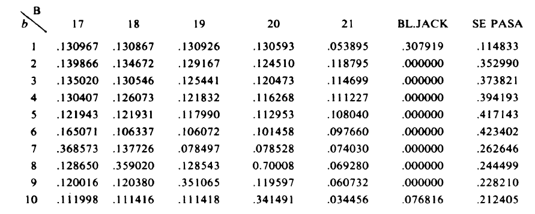
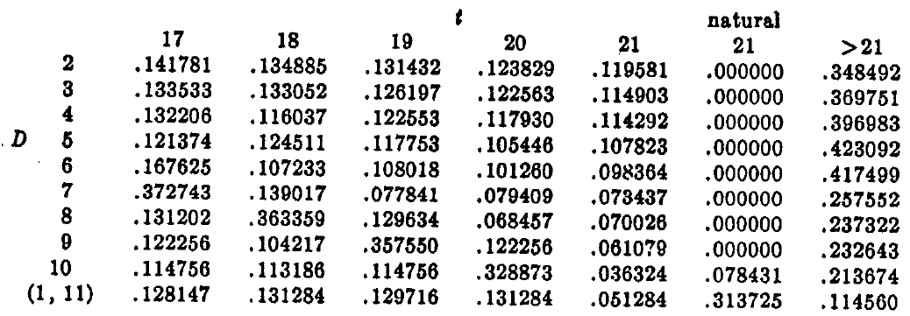

---
output:
  pdf_document:
    keep_tex: yes
    number_sections: yes
    citation_package: natbib  # comentado usa: pandoc-citeproc
    template: latex/templateMemoriaTFE.tex
    pandoc_args: ["--metadata-file=cabecera_capitulos.yaml"]
  html_document: default
#bibliography: bib/library.bib # descomentar si: editor visual RStudio  
---

<!-- escribir 2 para capítulo 3 -->
<!-- \setcounter{chapter}{2} --> 
<!-- \pagenumbering{arabic} -->

`r xfun::file_string('cabecera_capitulos.tex')`

```{r include=FALSE}
source("cabecera_chunk_inicio.R")
```


# Estudios individuales en el BlackJack. Diferenciamos por casos{#Seccion4}
Hacemos un breve recordatorio de varios puntos que comentamos en el apartado anterior y que vamos a utilizar individualmente en este apartado

**Mano dura:** son aquellas manos del jugador que teniendo un as, si este vale 11 podemos pasarnos de 21.

**Mano blanda:** son las manos del jugador que pueden tener un as valiendo 11 sin excederse del total de 21.
Si tomamos la decisión de pedir una carta mas y con ella pasamos el límite, ese as pasa a tener valor de 1. 

**Suma de las cartas:** que notaremos por $x$.

**Carta del crupier:** que notaremos por $D$.

**Valor final del crupier:** que es una variable aleatoria notada por $T$.

**Suma del jugador:** es una variable aleatoria notada por $J$ que representa la suma del jugador tras pedir una única carta mas.

De aquí en adelante dejamos claro que la cantidad apostada por el jugador es una unidad monetaria, ya sea euro o dolar, para asi simplificar los calculos

## Manos duras{#Seccion41}

Notemos por $b$ la carta que se sirve el crupier. $b = 2, \cdots, 10, (1,11)$. Así pues en cada momento tenemos el para $(x,b)$ en la que el jugador tiene la información de $x$ puesto que es el valor total de sus cartas y ve la carta que se sirve el crupier. En esta situación el jugador debe decidir si parar y plantarse o pedir mas cartas. 

Definimos entonces $G^*(x,b)$ como la máxima ganancia esperada por el jugador dado una situación $(x,b)$ suponiendo que el jugador actúa de forma optima y juega de manera racional.

De igual manera definimos $G_0(x,b)$ como la ganancia esperada por el jugador si este decide plantarse ante la situación del juego $(x,b)$.

Recordamos también que suponemos que la probabilidad de tener una determinada carta de un valor es equiprobable es decir, la probabilidad (notemos la como $P_c$) de obtener una carta de valor $c$ es:

$$
P_c = 
\begin{cases}
4/13 & \text{si } c=10 \\
1/13 & \text{si } c \neq 10
\end{cases}
$$
Con esta información podemos caracterizar $G^*(x,b)$ como:

$$
G^*(x,b) = Max \\ \{G_0(x,b), \sum_{c=1}^{10}P_cG^*(x+c,b) \}
$$

Es decir, tenemos el máximo entre la opción de plantarnos en ese instante o de la situación en la que nos encontraríamos si pidiéramos una carta mas. Así nos plantaremos cuando el máximo lo alcancemos el $G_0(x,b)$.

Nos queda evaluar ese máximo para cada $x$ y cada $b$ posibles. Para poder hacerlo necesitamos lo siguiente:

1. $G_0(x,b)$, $\forall x=4, \cdots$ y $\forall b= 2, \cdots, 10, (1,11)$

2. Algunos valores finales de $G^*(x,b)$ para iniciar el la inducción hacia atrás, $\forall x,b$

**Calculo de $G_0(x,b)$**

De lo que obtuvimos en la sección anterior sabemos que:

$$ 
G_0(x,b) \ = \ Pr(T>21) \ + \ Pr(T<x) \ - \ Pr(x<T \leq 21) 
$$
Ha de constar que esta ganancia se basa en que estamos apostando

Así pues el siguiente paso es calcular las probabilidades del crupier que dada una carta de valor $b$, la variable $T$ tenga un determinado valor final. 

**Cálculo de las probabilidades de la variable $T$ dada una carta conocida $b$**

```{r,include=FALSE}
library(knitr)
library(kableExtra)
library(tidyverse)
Cartas <- c("1","2","3","4","5","6","7","8","9","Figura","As")
Cantidad_de_cada_carta <- c(4,4,4,4,4,4,4,4,4,16,4)
Valor_cartas <- c(1,2,3,4,5,6,7,8,9,10,11)
Probabilidades_sacar_carta = Cantidad_de_cada_carta/sum(Cantidad_de_cada_carta)

set.seed(47563)
sample(Cartas,size = 2,prob = Probabilidades_sacar_carta,replace = T)

encuentra_as_en_mano <- function(mano){
  if ("As" %in% mano) {
    return(TRUE)
  } else {
    return(FALSE)
  }
}

cuenta_ases_mano <- function(mano){
  numero_ases=0
  for (carta in mano) {
    if (carta=="As") {
      numero_ases=numero_ases+1
    }
  }
  return(numero_ases)
}


Devuelve_salida <- function(suma,mano){
  if (suma== 21 && length(mano)==2 && (all(sort(mano) == sort(c("Figura", "As"))))) {
    return("BlackJack")
  } else{
      if (suma >21) {
        return("Se pasa")
      } else{
        return(as.character(suma))
      }
    } 
  } 


Calcular_suma_mano_crupier <- function(mano){
    suma=0
    if (encuentra_as_en_mano(mano)) {
      mano_sin_ases <- mano[mano != "As"]
      mano_solo_ases <- mano[mano == "As"]
      for (carta in mano_sin_ases) {
        suma= suma + Valor_cartas[which(Cartas == carta)]
      }
      while (cuenta_ases_mano(mano_solo_ases)>0) {
        if (suma + 11 <= 21) {
          suma = suma + 11
        } else {
          suma = suma + 1
          
        }
        mano_solo_ases =mano_solo_ases[-1]
      }
      } 
      else {
      for (carta in mano) {
        suma= suma + Valor_cartas[which(Cartas == carta)]
      }
      }
    return(suma)
}

Mano_dada_crupier <- function(b){ #b es la carta que todos ven que tiene el crupier
  suma=0
  mano=c(b)
  while (suma<17) {
    carta_1 <- sample(Cartas,size = 1,prob = Probabilidades_sacar_carta)  
    mano = c(mano,carta_1)
    suma=Calcular_suma_mano_crupier(mano)
  }
  Devuelve_salida(suma,mano)
}

resultados_tabla <- data.frame()

# Calcular probabilidades para cada carta visible
for (carta in Cartas) {
  salida <- replicate(100000, Mano_dada_crupier(carta))
  tabla <- prop.table(table(factor(salida, 
                                   levels = c("17","18","19","20","21","BlackJack","Se pasa"))))
  resultados_tabla <- rbind(resultados_tabla, as.numeric(tabla))
  colnames(resultados_tabla)=c("17","18","19","20","21","BlackJack","Se pasa")
}
rownames(resultados_tabla)=c("1","2","3","4","5","6","7","8","9","Figura","As")
```

```{r,echo=FALSE,warning=FALSE}
kable(round(resultados_tabla, 6), 
      caption = "Probabilidades de resultado final del crupier según carta visible",
      align = "c") %>%
  kable_styling(bootstrap_options = c("striped", "hover", "condensed"),
                full_width = F, font_size = 12)
```

Ahí tenemos las probabilidades calculadas en función de cada carta inicial que veamos. Si las comparamos con las de la biografía

```{r español_blackjack, fig.cap = "\\label{forma_extensiva}Diagrama Juego", fig.align='center',out.width='80%',echo=FALSE}


```

```{r ingles_blackjack, fig.cap = "\\label{forma_extensiva}Diagrama Juego", fig.align='center',out.width='80%',echo=FALSE}


```

Podemos ver que los resultados son muy similares, por lo que podemos deducir que los cálculos que hemos realizado son correctos. Una vez conocidas las probabilidades, ya estamos en disposición de calcular $G_0(x,b)$ como detallábamos al comienzo, $\forall \ x=4,\cdots$ y $\forall \  b=2,\cdots,10,(1,11)$


## Manos blandas{#Seccion42}

Ahora, nuestro propósito es hacer lo mismo para el caso de que el jugador posea una mano blanda. La principal modificación reside en lo que comentamos al comienzo, que si nos pasamos de 21 con este tipo de manos recurrimos a contar ese As como un 1. Ahora llamamos $\bar G^*(x,b)$ a la ganancia esperada en el caso de manos blandas.

$$
\bar G^*(x,b) = Max \\ \{G_0(x,b), \sum_{c=1}^{10}P_c \bar G^*(x+c,b) \}
$$
Como vemos la ecuación es exactamente igual al caso de manos duras. Lo que diferencia el tratamiento son los valores finales que le damos a $\bar G^*(x,b)$, por el tratamiento diferente que reciben estas manos. los valores iniciales son:
$\bar G^*(x,b) = G^*(x-10,b),x>21$ y $\forall b$

Ahora nuestra regla de parada es la siguiente:


## Doblar la apuesta{#Seccion43}

Para poder doblarnos los valores de las dos primeras cartas deben sumar 9, 10 u 11, recibiendo una carta mas y solo una si lo hace. Así tenemos las siguientes situaciones $(9,b)$, $(10,b)$, $(11,b)$, $\forall b$. Ahora tenemos que calcular la ganancia esperada de doblar nuestra apuesta, en función de la carta que nos toque y compararla con la ganancia esperada en el caso de no hacerlo, resultando en:

$$
\begin{array}{cllll}
\text{Si} & 2 \sum_{c=1}^{10}P_cG_0(x+c,b) & > & G^*(x,b) & \text{doblar apuesta} \\
\text{Si} & 2 \sum_{c=1}^{10}P_cG_0(x+c,b) & \leq & G^*(x,b) & \text{no doblar apuesta}\\
\end{array}
$$

Y la estrategia optima de cuando doblarse y cuando no es la siguiente:


## Abrise y jugar a dos manos{#Seccion44}

En este apartado tendremos que comparar la ganancia esperada cuando no nos abrimos y jugamos de manera óptima como hicimos en los subapartados $\ref{#Seccion41}$ y $\ref{#Seccion41}$, a la ganancia que tendríamos en el caso de abrirnos y jugar óptimamente cada una de las manos.

Así, construimos la siguiente regla que nos marca que camino tenemos que coger:

$$
\begin{array}{cllll}
\text{Si} & 2 \sum_{c=1}^{10}P_cG^*(z+c,b) & > & G^*(2z,b) & \text{Abrirse} \\
\text{Si} & 2 \sum_{c=1}^{10}P_cG^*(z+c,b) & \leq & G^*(2z,b) & \text{No abrirse}\\
\end{array}
$$
Donde $z$ es la carta que recibimos doble. Aquí nos encontramos un pequeño impedimento que es el caso cuando recibimos dos Ases, en este caso tendríamos que:

$$
\begin{array}{cllll}
\text{Si} & 2 \sum_{c=1}^{10}P_cG_0(11+c,b) & > & \bar G^*(12,b) & \text{Abrirse} \\
\text{Si} & 2 \sum_{c=1}^{10}P_cG_0(11+c,b) & \leq & \bar G^*(12,b)& \text{No abrirse}\\
\end{array}
$$

Y obtendríamos las siguientes conclusiones:

## Asegurarse{#Seccion45}

Suponemos ahora que la carta visible del crupier es un As. La apuesta adicional que puede hacer el jugador es de un valor $v$, $v \leq \frac{1}{2}$. Lo que ocurre aquí, es que el jugador decide asegurarse, su mano ya no compite contra el crupier, sino que el compite contra el hecho de que el crupier obtenga un BlacjJack. Por ejemplo, si la suma de cartas del jugador es 13 y la primera carta del crupier es un As, este podría asegurarse. En caso de hacerlo, si el crupier no obtuviera BlackJack, obtuviera una suma de 20, el jugador gana aunque su suma es inferior a la suma del crupier.

Esta apuesta por tanto se reduce al hecho de que salga una figura o no. La probabilidad de que salga una figura, como desde un comienzo estamos en la hipótesis de sucesos equiprobables, es de $\frac{16}{52}$ que es aproximadamente $0.3077 \aprox 30,77 \%$. Llamemosle $p$ a la probabilidad de que salga una figura, obteniendo el crupier un blackjack. Supongamos que la cantidad con la que nos aseguramos es $v=\frac{1}{2}$. Entonces nos interesa que el valor esperado al asegurarnos sea no negativo al menos.

El valor esperado lo podemos calcular con la fórmula $E[ \ Asegurarse \ ]= 1·p - \frac{1}{2}·(1-p)$ veamos cuando esa esperanza es mayor o igual a 0:

$$
\begin{array}{ccl}
p - \frac{1}{2}(1-p)& \geq  & 0 \\
p - \frac{1}{2} +\frac{1}{2}p& \geq  & 0\\
\frac{3}{2}p - \frac{1}{2} & \geq  & 0\\
3p - 1& \geq  & 0 \\
p & \geq & \frac{1}{3}
\end{array}
$$
Es decir, para que asegurarse sea rentable la probabilidad debe ser al menos de un tercio, $33,3 \%$, por lo que no sería rentable asegurarse, ya que la probabilidad que tenemos actualmente es inferior. Esta probabilidad podría aumentar si el jugador viese si faltan muchas figuras por salir de la baraja.

Como hemos asumido como hipótesis inicial que sacar una carta es equiprobable a sacar otra, es decir, no contamos cartas, descartamos el hecho de que asegurarse sea rentable a la larga y por lo tanto la conclusion es no asegurarse.

Algo que podemos hacer es construir la forma normal del juego para ver como sería este reparto:

```{r}
tabla <- matrix(c(1,1,0,3/2),nrow = 2,ncol = 2,byrow = T)
rownames(tabla) <- c("J Asegura","J No Asegura")
colnames(tabla) <- c("C BJ","C No BJ")
kable(tabla, 
      caption = "Forma normal cuando jugador posee un Blackjack",
      align = "c") %>%
  kable_styling(bootstrap_options = c("striped", "hover", "condensed"),
                full_width = F, font_size = 12)
```

Esto podríamos extenderlo a todos los casos, cuando la suma del jugador es $x$, que no es un Blackjack, y en caso de no conseguir un Blackjack, la suma del crupier es $T$ a lo siguiente y calcular las ganancias esperadas en cada caso en función de la probabilidades de que $T$ supere a $x$ o no

## Conclusion. Utilidad de seguir la estrategia óptima.{#Seccion46}

Ahora ya tenemos determinada nuestra estrategia optima, en la que sabemos en que suma de cartas debemos plantando en función de si tenemos una mano dura o una mano blanda; si debemos doblarnos o no dependiendo de la carta que tenga visible el crupier; si debemos abrirnos y jugar a dos manos siguiendo las estrategias anteriormente comentadas; y si debemos asegurarnos, que sabemos que nunca lo debemos hacer. 

Nuestro objetivo ahora es calcular cuantas unidades monetarias obtendremos por cada una apostada en este juego, si siguiéramos la estrategia ideal. 

Para ello, para cada situación inicial que se presenta, carta visible del crupier mas las dos cartas iniciales del jugador se genera una cantidad grande de jugadas calculando la cantidad media de ganancia obtenida en cada una mediante los métodos de montecarlo y se pondera por la probabilidad de que suceda esa mano