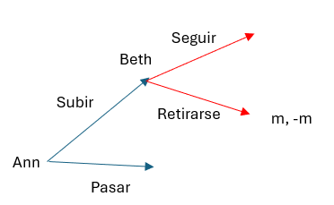
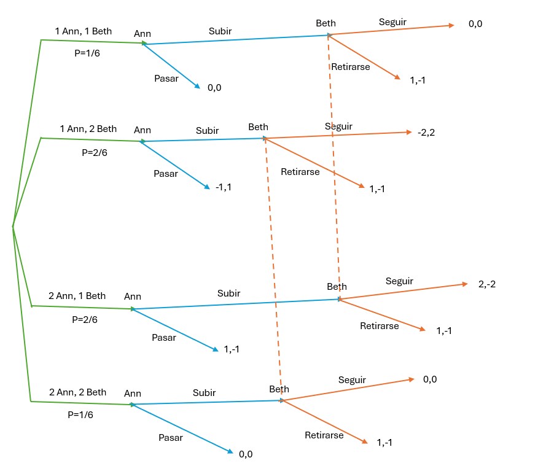
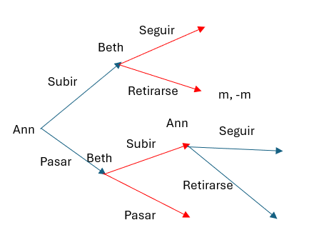

---
output:
  pdf_document:
    keep_tex: yes
    number_sections: yes
    citation_package: natbib  # comentado usa: pandoc-citeproc
    template: latex/templateMemoriaTFE.tex
    pandoc_args: ["--metadata-file=cabecera_capitulos.yaml"]
  html_document: default
#bibliography: bib/library.bib # descomentar si: editor visual RStudio  
editor_options: 
  markdown: 
    wrap: 72
---

<!-- escribir 2 para capítulo 3 -->

<!-- \setcounter{chapter}{2} -->

<!-- \pagenumbering{arabic} -->

`r xfun::file_string('cabecera_capitulos.tex')`

```{r include=FALSE}
source("cabecera_chunk_inicio.R")
```

# VNM-Póker y Khun-Póker{#Seccion5}

En este último apartado comentaremos otro juego de azar que introdujeron Von Newmann y Morgenstern, el VNM-Póker, junto con una variante que amplía este juego y que se conoce como Khun-Poker. El primero fue introducido en *Theory of Games and Economic Behavior*, mientras que el segundo se introdujo en *A simplified two-person poker.Contributions to the Theory of Games* .

Los dos juegos costan de dos jugadores, comúnmente llamados Ann y Beth. Cada una de ellas coge al azar una carta de la baraja sin enseñársela a la otra. Así podríamos decir que los juegos presentan 4 parámetros:

1. Hay una baraja con cartas de valores que van de 1 a $S$.

2. Cada carta está representada $r$ veces en la baraja.

3. Una apuesta inicial de $m$ uds. monetarias que cada jugador realiza antes de empezar la partida.

4. Un valor final de la apuesta total de cada jugador, que denotamos como $n$, al cual el jugador puede llegar añadiendo $n-m$ uds. monetarias adicionales.

Como regla general se considera que $m<n$.

## VNM-Póker. Explicación, estrategias y equilibrios{#Seccion51}

**$VNM-Póker(S,r,m,n)$** . El juego comienza repartiendo una carta a cada jugador, y a continuación, Ann mueve primero y elige si pasar, jugando así por $m$, o subir, jugando así por $n$. Ahora nos encontramos con dos posibles situaciones:

* Si Ann pasa, ambas jugadores revelan sus dos cartas, y el jugador que tenga la carta mas alta gana el bote, que como no se ha subido la apuesta es de $2m$ uds. monetarias. Si hubiera empate, cada jugador recupera su dinero.

* Si Ann elige subir, incrementa su apuesta hasta n. A continuación, le toca el turno a Beth que tiene dos posibles movimientos, retirarse o seguir.
  - Si Beth se retira, Ann se lleva el bote encima de la mesa que consta de los $n$ suyos más los $m$ de Beth, por lo que gana $m$. La carta de Beth no se levanta en este caso.
  - Si Beth decide seguir la apuesta, ella también incrementa su apuesta hasta $n$. Entonces cada una revela su carta, y el que tenga la carta de mayor valor se lleva el bote completo de $2n$ ganando así $n$. De la misma manera que antes, en caso de empate los jugadores recuperan su dinero.

El juego, según [@Libro7] podemos clasificarlo dentro de los de suma cero, puesto las ganancias de uno viene de las perdidas del otro, y al final el dinero que se reparte es el dinero que proviene de las apuestas de los dos jugadores. Procedemos ahora a representar la forma extensiva de este juego.


```{r VNM_Khun, fig.cap = "\\label{forma_extensiva_VNM}VNM-Póker", fig.align='center',out.width='80%',echo=FALSE}


```

Como hemos comentado, el juego comienza dándole una carta al azar a cada jugador. Ann puede coger una carta cualquiera de $1,\cdots,S$, y en función del valor del parámetro $r$ Beth podrá tomar también una carta de $1,\cdots,S$ dando $S^2$ posibles combinaciones si $r>1$ y en caso de $r = 1$, habría $S(S-1)$ posibles combinaciones. 

Con esto nos damos cuenta que los parámetros intervienen de forma distinta: mientras que $m$ y $n$ intervienen en el aspecto de apuesta y reparto del dinero, los parámetros $S$ y $r$ tienen influencia en la forma y tamaño del árbol del juego, y las probabilidades de los movimientos que dependen del azar.

Según [@Libro5], las alternativas para el movimiento aleatorio de recibir una determinada carta no son igualmente probables. Por ejemplo, si fijamos una carta determinada llamemosle $C$, la probabilidad de obtener $C$ es $\frac{r}{rS}= \frac{1}{S}$. una vez se saca dicha carta del mazo, quedan $r-1$ cartas $C$ de un total de $rS-1$, por lo que la probabilidad de obtener otra carta $C$ es $\frac{r-1}{rS-1}$. Como resumen:

* Si Ann y Beth tienen cartas de igual valor $c$, esto tiene una probabilidad 

$$
p_{cc}=\frac{1}{S}  \frac{r-1}{rS-1}=\frac{r-1}{S(rS-1)}
$$

* Si Ann y Beth tienen cartas de distinto valor $c$ y $d$, esto tiene una probabilidad 

$$
p_{cd}=\frac{1}{S}  \frac{r}{rS-1}=\frac{r}{S(rS-1)}
$$

*Ejemplo VNM-Póker(2,2,1,1)*

```{r ejemplo_VNM, fig.cap = "\\label{ejemplo_VNM}VNM-Póker(2,2,1,1)", fig.align='center',out.width='80%',echo=FALSE}


```


### Estrategias{#Seccion511}

Si $r>1$ hay $S*S$ diferentes combinaciones para repartir un valor a Ann y otro a Beth. Ann como hemos dicho, solo puede ver su carta por lo que tiene $S$ conjuntos de información. En cada uno de esos conjuntos tiene las opciones de subir o pasar. Así pues, Ann tiene $2^S$ estrategias puras. Codificamos las estrategias por secuencias de $R$ y $C$ (de check y raise, traducción de pasar y subir). Por ejemplo, para $S=4$ seria $RCCR$ una posibilidad, que significa que Ann sube la apuesta con la carta más alta y más baja, y pasa en las dos cartas intermedias. De la misma manera, Beth tiene $S$ conjuntos de información con dos opciones y por lo tanto también tiene $2^S$ estrategias puras que están codificadas por $C$ y $F$ (traducciones de seguir y retirarse).

De esta manera los posibles pagos son:

* Ann elige pasar $\rightarrow$ $m$, $0$ ó $-m$.

* Ann elige subir y Beth elige retirarse $\rightarrow$ $m$.

* Ann elige subir y Beth elige seguir $\rightarrow$ $n$, $0$ ó $n$.

En adelante supondremos $S=2$ y $r \geq 2$ . Suponiendo esto, tenemos los siguientes conjuntos de estrategias puras para Ann es $\{$CC (conservadora), CR (equilibrada),RC (inútil),RR (arriesgada) $\}$ y para Beth $\{$FF (conservadora), FC (equilibrada),CF (inútil),CC (arriesgada) $\}$.

Al igual que antes hicimos con la forma extensiva, representamos la forma normal del juego con $S=2$


$$
\begin{array}{c|c|c|c|c}
 & \text{FF} & \text{FC} & \text{CF} & \text{CC} \\
\hline
\text{CC} & 0 & 0 & 0 & 0 \\
\hline
\text{CR} & \frac{m(r-1)}{4r-2} & 0 & \frac{nr-m}{4r-2} & \frac{(n-m)r}{4r-2} \\
\hline
\text{RC} & \frac{m(3r-1)}{4r-2} & \frac{m(2r-1)-rn}{4r-2} & \frac{2mr}{4r-2} & \frac{r(m-n)}{4r-2}  \\
\hline
\text{RR} & m & \frac{m(2r-1)-rn}{4r-2} & \frac{m(2r-1)+rn}{4r-2} & 0 \\
\hline
\end{array}
$$
Pasamos a comentar cómo hemos obtenido las expresiones para esta tabla. Para cada par de estrategias, definimos $u_{x,y}$ como el pago que recibe Ann cuando los jugadores siguen sus estrategias y Ann tiene una carta de valor $x$ y Beth una de valor $y$, así la utilidad esperada para Ann es la siguiente:

$$
p_{xx}u_{1,1} + p_{xy}u_{1,2} + p_{xy}u_{2,1} + p_{xx}u_{2,2}
$$
donde $p_{xx}=\frac{r-1}{4r-2}$ y $p_{xy}=\frac{r}{4r-2}$

Así, si Ann juega la estrategia $RR$ y Beth juega $FC$ tendríamos las utilidades $u_{1,1}=m$,$u_{1,2}=-n$,$u_{2,1}=m$ y$u_{2,2}=0$ y la utilidad que recibe Ann es:

$$
\begin{array}{ccl}
 &  & p_{xx}m + p_{xx}(-n) + p_{xx}m + p_{xx}0 \\
        & = & \frac{r-1}{4r-2}m +\frac{r}{4r-2}(-n) + \frac{r}{4r-2}m +\frac{r-1}{4r-2}0 \\
        & = & \frac{(r-1)m - rn +rm}{4r-2} \\
        & = & \frac{(2r-1)m-rn}{4r-2}m
\end{array}
$$

Aunque hemos puesto en la tabla todas las estrategias posibles, somos conscientes de que en algunos casos hay estrategias que están dominadas por otras:

* Cuando Ann tiene una carta de mayor valor que Beth, subir domina a pasar.

* Cuando Beth tiene una carta mas alta que la de Ann, seguir domina a retirarse.

Podemos extender esto a casos mas generales con el siguiente teorema:

**Teorema**

Todas las estrategias de Beth, menos las de la forma $C \cdots C$ y las de la forma $F \cdots FC \cdots C$ están débilmente dominadas. La demostración del teorema se puede encontrar en [@Libro7] *pag 189*.

Haciendo uso de este teorema podemos simplificar la forma normal del juego a:

$$
\begin{array}{c|c|c|}
 & \text{FC} & \text{CC} \\
\hline
\text{CR} & 0  & \frac{(n-m)r}{4r-2} \\
\hline
\text{RR} & \frac{m(2r-1)-rn}{4r-2}  & 0 \\
\hline
\end{array}
$$

Una estrategia alternativa que podría seguir un jugador, es la de *tirarse un farol* que consiste en, aun teniendo una carta de valor bajo, este jugador decide subir la apuesta para intentar amedrentar al otro jugador para que así este decida retirarse. Desde el comienzo del trabajo hemos supuesto la hipótesis de racionalidad de los jugadores por lo que esta estrategia no tendría sentido. Pasemos ahora a analizar las distintas estrategias.

### Análisis del juego{#Seccion512}

* Equilibrio puro.

La entrada $\frac{(n-m)r}{4r-2}$ siempre es $>0$ puesto que $n>m$. Si $\frac{(2r-1)m-rn}{4r-2}$ es $<0$, la estrategia de Ann $CR$ domina débilmente a $RR$, y la estrategia de Beth $FC$ domina débilmente a $CC$. Por lo tanto, hay un equilibrio de Nash puro $(CR,FC)$ con una utilidad esperada para Ann de $0$.

* ¿Qué hacer si el adversario no juega de manera óptima, sino mezclando estrategias puras no dominadas?

Vamos a suponer que el jugador que juega de esa manera es Beth, que lo hace de la siguiente manera: elige $FC$ con una probabilidad $q$ y elige $CC$ con probabilidad $1-q$, es decir, elige seguir cuando tiene una carta de valor 2; y retirarse con una probabilidad $q$ cuando tiene una carta de valor $1$

¿Qué tendría que hacer Ann en cada situación? Por un lado, si miramos los pagos, Ann al jugar $CR$ es $\frac{(1-q)(n-m)r}{4r-2}$ que es mayor o igual a $\frac{q((2r-1)m-rn)}{4r-2}$ que es el pago al jugar $RR$ si (esto se da puesto que $4r-2>0$ ya que $r \geq 1$):

$$
\begin{array}{rcl}
\frac{(1-q)(n-m)r}{4r-2} & \geq &\frac{q((2r-1)m-rn)}{4r-2}\\
(1-q)(n-m)r & \geq & q((2r-1)m-rn) \\
(n-m)r -q(n-m)r & \geq & q((2r-1)m-rn)\\
(n-m)r & \geq & q[((2r-1)m-rn)+(n-m)r]\\
(n-m)r & \geq & q[(r-1)m]\\
\end{array}
$$

Como $r \geq 2$ tenemos que $(r-1)m >0$, lo podemos pasar dividiendo sin cambiar el signo de la desigualdad y tendríamos:

$$
q^* = \frac{(n-m)r}{(r-1)m} \geq q
$$
Por lo que Ann debe jugar $CR$ si Beth juega $FC$, mientras que en otro caso Ann debería jugar $RR$, jugando así de manera opuesta al comportamiento de Beth. Por su parte, Beth debería copiar las jugadas que haga Ann.

* Equilibrio mixto.

Si $\frac{n}{m} \geq 2- \frac{1}{2}$ no hay equilibrio de Nash puro y tendríamos que encontrar uno mixto.

Supongamos que Ann juega $CR$ con probabilidad $p$ y $RR$ con probabilidad $1-p$, y Beth juega $FC$ con probabilidad $q$ y $CC$ con probabilidad $1-q$. Cada una de las estrategias puras $(CR,FC)$ y $(RR,CC)$ es una mejor respuesta a ellas y concluimos con:

$$
p=\frac{(2r-1)m-rn}{(r-1)m} \ y \ q=\frac{(n-m)r}{(r-1)m}
$$

## Khun-Póker. Cambios respecto al VNM-Póker{#Seccion52}

**$Kuhn-Poker(S,r,m,n)$** Este juego extiende el VNM-Póker. Si Ann decide pasar los jugadores juegan un VNM-Póker con los roles cambiados. Ann mueve primero eligiendo entre pasar o subir.

* Si Ann decide pasar, entonces Beth puede pasar o subir:
  - Si Beth pasa, ambas cartas se levantan para hacerlas visibles, y el que tenga la carta más alta se lleva el bote; mientras que si empatan los jugadores recuperan su dinero.
  - Si Beth elige subir, incrementa su apuesta hasta $n$. Entonces Ann tiene dos opciones, retirarse o seguir.
    * Si Ann se retira, Beth se lleva la cantidad de $n+m$, y la carta de Ann no se revela.
    * Si Ann sigue, incrementa su apuesta hasta $n$. Entonces ambas cartas se revelan y el que tenga la carta mas alta se lleva los $2n$ de la apuesta y recuperan su dinero en caso de empate.

* Si Ann sube, el juego funciona como el VNM-Póker cuando Ann sube.


```{r forma_extensiva_VNM, fig.cap = "\\label{forma_extensiva_VNM}Kuhn-Póker", fig.align='center',out.width='80%',echo=FALSE}


```

### Estrategia{#Seccion521}

Ann tiene $2S$ conjuntos de información: o bien ella hace su primer movimiento, subir o pasar, si Ann ha pasado en su primer movimiento, y Beth ha subido, entonces Ann puede seguir o retirarse. En todos esos casos, ella solo conoce el valor de su carta. Beth tiene $2S$ conjuntos de información, determinados por el valor de su carta y en función de si Ann ha subido o pasado, con $S$ conjuntos de información en cada uno. 

Por lo tanto, Ann tiene $2^{2S}$ estrategias puras, indicadas por $S$ letras que pueden ser como en la sección $\ref{Seccion511}$ $R$ o $C$ para las elecciones de subir o pasar, y también $S$ letras $F$ o $C$ para la elección de retirarse o seguir. Así, para $S=2$ tenemos 16 estrategias puras, que son $CCFF$, $CCFC$, $CCCF$, $CCCC$, $CRFF$, $CRFR$, $CRCF$, $CRCC$, $RCFF$, $RCFC$, $RCCF$, $RCCC$, $RRFF$,$RRFC$, $RRCF$, y $RRCC$. 

De la misma manera, Beth también tiene $2S$ conjuntos de información, $S$ cuando Ann sube y otros $S$ cuando Ann pasa, así para $S=2$ tendríamos: $FFCC$, $FFCR$, $FFRC$, $FFRR$, $FCCC$, $FCCR$, $FCRC$, $FCRR$, $CFCC$, $CFCR$, $CFRC$, $CFRR$, $CCCC$,$CCCR$, $CCRC$, y $CCRR$.

Hemos podido eliminar algunas estrategias por estar dominadas al igual que antes. Si Ann tiene un valor de carta mayor que el de Beth, y ella pasa cuando Beth sube, siempre es mejor para Ann seguir y no retirarse, puesto que retirándose pierde $m$ uds. monetarias mientras que si sigue no puede perder. Si Ann tiene un valor de carta más alto, subir no domina necesariamente a pasar, ya que depende de la estrategia de Beth. Si Beth tiene una carta de valor mas alto que Ann, seguir domina a retirarse y subir domina a pasar. 


## Conclusiones Finales

El presente trabajo ha abordado el estudio de varios  juegos de azar
desde la perspectiva de la Teoría de Juegos y mediante herramientas de
simulación. En el caso del Blackjack se ha cuantificado en cierta
forma la frase "la banca siempre gana", ya que aunque un jugador
juegue de forma racional empleando la estrategia óptima, perderá en
torno a un 20 % del dinero que apueste.
Este resultado ha sido obtenido a través de la creación de unos
algoritmos, que simulan las condiciones de una partida usual entre un
jugador y el crupier. En estos algoritmos hemos usado la
equiprobabilidad de obtener una carta frente a otra, supuesto con el
que trabajábamos desde un comienzo. 

Una posible ampliación podría ser cambiar esa suposición, y modificar los algoritmos con el hecho de que el jugador cuente las cartas. Sabemos que la equiprobabilidad de las cartas no es del todo cierta, puesto que si se extrae por ejemplo un 8 de un palo cualquiera, para asegurarnos de la equiprobabilidad de una carta siguiente, tendríamos que introducir una carta similar en la baraja y barajar de nuevo, algo que no sucede. 

En los algoritmos hemos construido el mazo de 52 cartas y al extraer una se reemplaza, si modificamos ese aspecto y no reemplazamos, cambiamos la probabilidad de extraer una nueva carta como hemos comentando. Por tanto, la estrategia ideal que hemos construido se podría ver modificada, ya que si tuviéramos una suma de 19, y el jugador contando las cartas se diese cuenta de que ya han salido todos los $2$, con total seguridad no pediría una carta más. 

De esta forma podríamos cambiar la estrategia y no hacerla solo en función de la carta visible del crupier como hemos hecho, sino que también podríamos hacerla en función de las cartas que el jugador vea (las que cuente y falten por salir). Podríamos  también modificar los algoritmos para que en vez de ser un solo jugador contra el crupier, participaran varios jugadores más, lo que alteraría en mayor modo el contar cartas (se sacan mas cartas del mazo y con una mayor probabilidad estas seguro de que te tocará una determinada carta).

Además podríamos pensar en si estos resultados son reproducibles para otros juegos de casino también. En todos los juegos de casino jugamos "a ciegas" en el que solo conocemos nuestras cartas y no las de nuestro adversario, sin embargo, en el blackjack tenemos la ventaja de conocer una carta de nuestro adversario (el crupier), y también conocemos la estrategia que sigue, por lo que desde este punto de vista es uno de los juegos más beneficiosos para los jugadores, y los resultados que extraemos del mismo no los podemos implementar en otros juegos como puede ser la Ruleta o el Poker.

La estrategia que obtenemos está basada en la racionalidad del jugador en su desempeño, pero conocemos que el jugador se ve influenciado por circunstancias que se dan a lo largo del juego, que hacen que no opere de tal forma como son el cansancio del jugador tras muchas partidas, la rapidez del crupier repartiendo cartas, etc. Por lo que esa estrategia hay veces que no se seguirá disminuyendo el valor esperado a obtener por parte del jugador.


